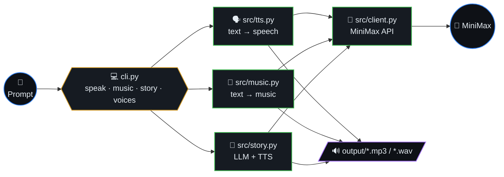
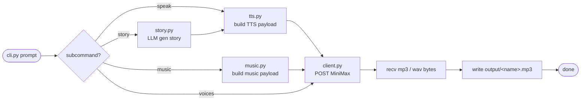
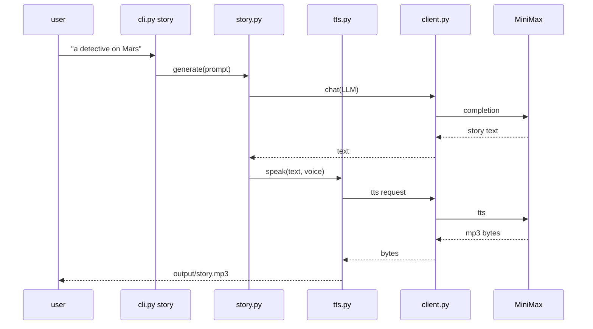

# MiniMax Audio Forge

AI-powered audio content generation pipeline using the [MiniMax](https://www.minimaxi.com/) API. Generate speech, music, and narrated stories from text prompts.



## Table of contents

- [Features](#features)
- [Generation pipeline (algorithm)](#generation-pipeline-algorithm)
- [Story narration sequence](#story-narration-sequence)
- [Setup](#setup)
- [Usage](#usage)
- [Environment variables](#environment-variables)
- [Project structure](#project-structure)
- [License](#license)

## Generation pipeline (algorithm)



## Story narration sequence



## Features

- **Text-to-Speech** — Convert any text to natural-sounding speech with multiple voice presets
- **Music Generation** — Create original music from text descriptions
- **AI Story Narrator** — Generate a short story with MiniMax LLM, then automatically narrate it with TTS

## Setup

```bash
pip install -r requirements.txt
cp .env.example .env
# Add your MiniMax API key to .env
```

## Usage

```bash
# Text-to-Speech
python cli.py speak "Hello, welcome to MiniMax Audio Forge" --voice narrator

# Generate music
python cli.py music "upbeat lo-fi hip hop beat with piano" --duration 30

# AI-generated narrated story
python cli.py story "a detective solving a mystery on Mars"

# List available voices
python cli.py voices
```

## Environment Variables

| Variable | Description |
|---|---|
| `MINIMAX_API_KEY` | Your MiniMax API key (required) |
| `MINIMAX_GROUP_ID` | Your MiniMax group ID (optional) |

## Project Structure

```
├── cli.py           # CLI entry point
├── src/
│   ├── client.py    # MiniMax API client
│   ├── tts.py       # Text-to-Speech pipeline
│   ├── music.py     # Music generation pipeline
│   └── story.py     # AI Story Narrator (LLM + TTS)
├── requirements.txt
└── .env.example
```

## License

MIT
